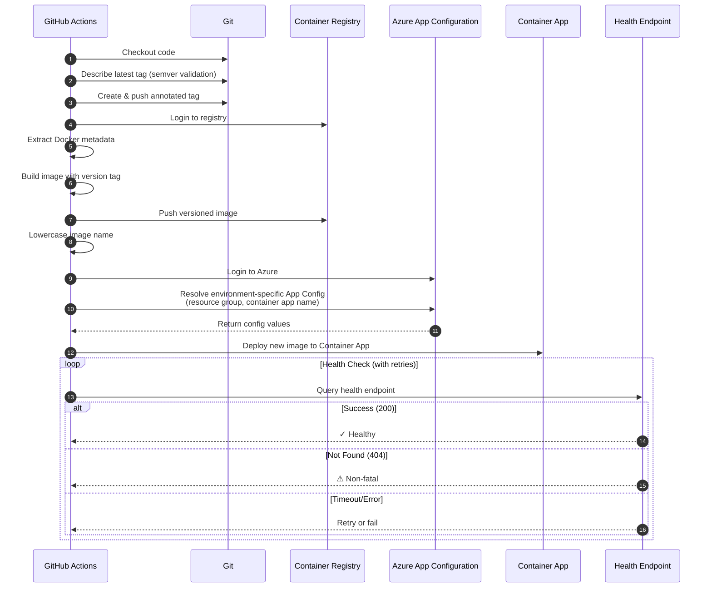

# Build and Deploy Container App (v1)

This reusable GitHub Actions workflow template automates the process of building, tagging, and deploying a Docker container application to Azure Container Apps. It enforces semantic versioning and performs post-deployment health validation.

## Features

*   **Semantic Versioning:** Automatically calculates the next patch version based on Git tags (e.g., `v1.0.0` -> `v1.0.1`).
*   **Git Tagging:** Creates and pushes a new Git tag for each release.
*   **Docker Build & Push:** Builds the Docker image and pushes it to the GitHub Container Registry (GHCR) with the new version tag.
*   **Sequential Deployment:** Deploys to environments (e.g., Dev -> QA -> Prod) sequentially.
*   **Dynamic Configuration:** Resolves Azure Resource Group and Container App names dynamically from Azure App Configuration.
*   **Health Checks:** Validates the deployment by querying the application's health endpoint (supports 404 warnings).

## Workflow Steps

1.  **Calculate Version:**
    *   Finds the latest Git tag.
    *   Validates it against strict SemVer (`vMAJOR.MINOR.PATCH`).
    *   Increments the `PATCH` version.
2.  **Tag Repository:**
    *   Creates a new Git tag (e.g., `v1.0.2`).
    *   Pushes the tag to the remote repository.
3.  **Build & Push:**
    *   Logs in to GHCR.
    *   Builds the Docker image using the provided `dockerfile` path.
    *   Tags the image with the calculated version.
    *   Pushes the image to the registry.
4.  **Deploy (Per Environment):**
    *   Logs in to Azure via OIDC.
    *   Resolves configuration variables (`RESOURCE_GROUP`, `CONTAINER_APP_NAME`) from Azure App Configuration using standard naming conventions.
    *   Deploys the specific image version to the Azure Container App.
5.  **Validate Health:**
    *   Polls the application's `/health` endpoint.
    *   Passes on `200 OK`.
    *   Warns (but passes) on `404 Not Found`.
    *   Fails on other errors or timeouts.

## Sequence Diagram



## Inputs

| Name | Type | Required | Description |
| :--- | :--- | :--- | :--- |
| `componentName` | `string` | **Yes** | Global component name (e.g., `PLATFORM`). Used for variable resolution. |
| `serviceName` | `string` | **Yes** | Global service name (e.g., `API`). Used for variable resolution. |
| `dockerfile` | `string` | **Yes** | Path to the Dockerfile (e.g., `src/WebApi/Dockerfile`). |
| `environments` | `json` | **Yes** | JSON array of environment objects. Example: `[{"name":"dev","region":"eastus"}]`. |

## Secrets

| Name | Description |
| :--- | :--- |
| `AZURE_CLIENT_ID` | Client ID for Azure OIDC login. |
| `AZURE_TENANT_ID` | Tenant ID for Azure OIDC login. |
| `AZURE_SUBSCRIPTION_ID` | Subscription ID for Azure OIDC login. |
| `AZURE_APP_CONFIGURATION_NAME` | Name of the Azure App Configuration store to resolve variables from. |

## Usage Example

```yaml
jobs:
  deploy-platform:
    uses: ./.github/workflows/templates/build-and-deploy-container-app-v1.yml
    with:
      componentName: "PLATFORM"
      serviceName: "API"
      dockerfile: "src/WebApi/Dockerfile"
      environments: |
        [
          {
            "name": "dev",
            "region": "eastus"
          },
          {
            "name": "qa",
            "region": "eastus"
          }
        ]
    secrets: inherit
```
