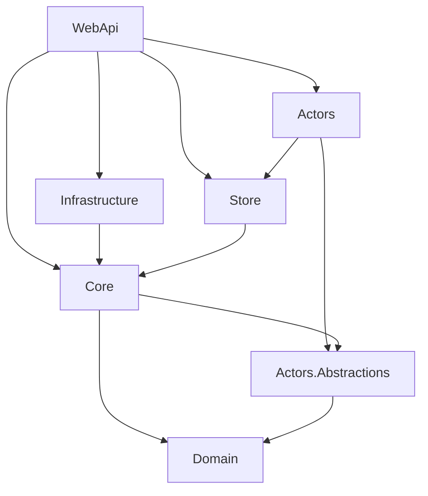

# Dilcore Platform

A new platform based on .NET 10.

## Domains

### Tenancy
Enables multitenancy capabilities within the platform. This domain manages tenants and controls user access to specific tenant environments.

### Identity
Handles user management at the platform level. It manages users and their relationships to tenants, including defining access levels and permissions.

## Project Structure

The solution is organized into modular domains (e.g., **Tenancy**, **Identity**). Each domain follows a strict Clean Architecture layering strategy with the following projects:

### Domain Layering
Each domain (`src/<Domain>`) consists of the following libraries:

| Project | Role | Dependencies |
|---------|------|--------------|
| **`<Domain>.Domain`** | **Core Domain Models** (DDD Aggregates, Entities, Value Objects) | *None* |
| **`<Domain>.Actors.Abstractions`** | **Orleans Interfaces** (Actor Contracts) | `Domain` |
| **`<Domain>.Actors`** | **Orleans Implementations** (Stateful Logic) | `Actors.Abstractions`, `Store` |
| **`<Domain>.Store`** | **Data Persistence** (Repositories, DB Contexts) | `Core` (Interfaces), `Domain` (Entities) |
| **`<Domain>.Core`** | **Business Logic** (Services, Use Cases) | `Domain`, `Actors.Abstractions` |
| **`<Domain>.Infrastructure`** | **External Services** (Email, Bus, 3rd Party APIs) | `Core` (Interfaces) |
| **`<Domain>.WebApi`** | **Entry Point** (Minimal APIs, Controllers) | All Domain Projects |

### Dependency Graph

*Note: `Store` and `Infrastructure` depend on `Core` to implement interfaces defined there (Dependency Inversion).*

## Architecture Rules
1.  **Strict Isolation**: Domains cannot reference each other directly (e.g., `Tenancy` cannot reference `Identity`).
2.  **Exception**: Domains **MAY** reference another domain's `Actors.Abstractions` to communicate via Orleans.
3.  **Circular Dependency Resolution**: `Core` depends on `Actors.Abstractions` to invoke actors; `Actors` depends on `Store` for persistence; `Store` depends on `Core` for interfaces.

## License

This project is licensed under the MIT License - see the [LICENSE](LICENSE) file for details.
