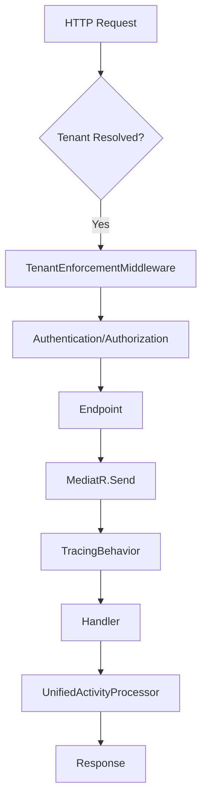
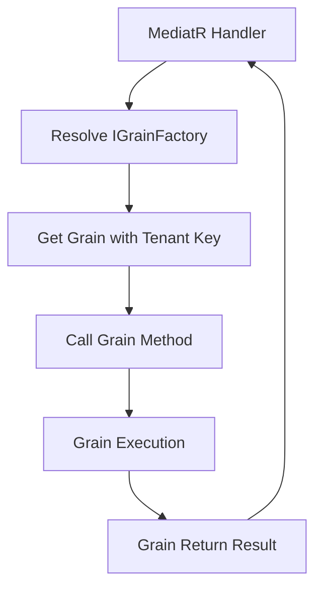
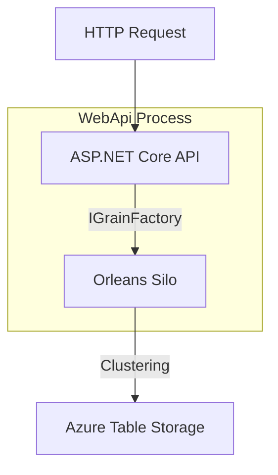
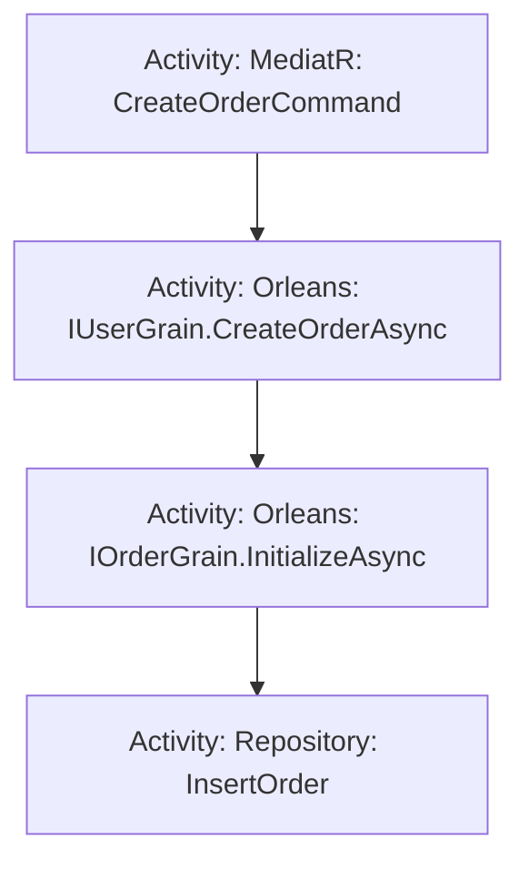

# Orleans Integration Architecture Plan

**Dilcore Platform - Distributed Actor Model Implementation**

**Version**: 1.0
**Date**: 2026-01-07
**Target Orleans Version**: 10.0.0-rc.2 (Latest Release)
**Status**: Planning Phase

---

## Table of Contents

1. [Executive Summary](#executive-summary)
2. [Current Architecture Analysis](#current-architecture-analysis)
3. [Orleans Architecture Overview](#orleans-architecture-overview)
4. [Integration Strategy](#integration-strategy)
5. [Multi-Tenancy Design](#multi-tenancy-design)
6. [MediatR and Orleans Interaction Patterns](#mediatr-and-orleans-interaction-patterns)
7. [OpenTelemetry Integration](#opentelemetry-integration)
8. [Implementation Phases](#implementation-phases)
9. [Detailed Implementation Steps](#detailed-implementation-steps)
10. [Performance Considerations](#performance-considerations)
11. [Security & Best Practices](#security--best-practices)
12. [Testing Strategy](#testing-strategy)
13. [Operational Considerations](#operational-considerations)
14. [References & Resources](#references--resources)

---

## 1. Executive Summary

This document outlines the comprehensive plan for integrating Microsoft Orleans (v9.2.1) into the Dilcore Platform to enable distributed, high-performance, actor-based processing while maintaining the existing clean architecture principles with MediatR, multi-tenancy, and OpenTelemetry.

### Key Objectives

- ✅ Enable distributed actor model processing using Orleans
- ✅ Maintain multi-tenant isolation at the grain level
- ✅ Preserve MediatR CQRS patterns for API entry points
- ✅ Ensure end-to-end distributed tracing with OpenTelemetry
- ✅ Achieve horizontal scalability and high availability
- ✅ Implement tenant-aware grain activation and state management

### Architecture Principles

1. **Co-hosted Deployment**: Orleans silo co-hosted within WebApi for serverless-style deployment
2. **Hybrid Processing**: WebApi → MediatR → Orleans Grains (not replacing MediatR)
3. **Tenant Isolation**: Tenant ID embedded in grain keys for complete isolation
4. **Distributed Tracing**: Activity propagation from HTTP → MediatR → Grains
5. **Resilient State**: In-memory state backed by repository pattern for durable storage

---

## 2. Current Architecture Analysis

### 2.1 Existing Architecture Strengths

The Dilcore Platform is built with modern .NET practices:

**Modular Monolith Structure**:

- Domain modules: Identity, Tenancy
- Shared infrastructure: Authentication, Configuration, MediatR, MultiTenant, Telemetry
- WebApi: Entry point orchestrating features

**Clean Architecture Patterns**:

- **CQRS via MediatR**: Commands and Queries with pipeline behaviors
- **Multi-Tenancy via Finbuckle**: Header-based tenant resolution with provider pattern
- **Observability via OpenTelemetry**: Unified processors enriching traces/logs with tenant/user context
- **Resilience via Polly**: Retry, timeout, circuit breaker policies on HTTP clients
- **Result Pattern via FluentResults**: Typed error handling

### 2.2 Current Request Flow



### 2.3 Integration Points for Orleans

Orleans will integrate at the **Handler layer**:



**Key Insight**: Orleans grains become the **execution layer** for stateful, distributed operations, invoked from MediatR handlers.

---

## 3. Orleans Architecture Overview

### 3.1 Core Concepts

**Grain**: Virtual actor that represents a single entity (e.g., User, Order, Session)

- Uniquely identified by type + key (string/GUID/integer/compound)
- Single-threaded execution guarantees (no race conditions)
- Automatically activated on first access, deactivated when idle
- Location-transparent (Orleans routes calls across cluster)

**Silo**: Orleans server process hosting grains

- Multiple silos form a cluster
- Grains distributed across silos for load balancing
- Silos use clustering provider (Azure Storage) to discover each other

**Grain State**: Persistent or in-memory state managed by `IPersistentState<T>`

- Loaded on activation (OnActivateAsync)
- Saved on demand (state.WriteStateAsync)
- Cleared on deactivation

**Activity Propagation**: Orleans supports distributed tracing via DiagnosticListener

- Traces flow from caller → grain → nested grain calls
- Requires enabling sources: "Microsoft.Orleans.Runtime" and "Microsoft.Orleans.Application"

### 3.2 Co-Hosted Silo Architecture

**Deployment Model**: Single WebApi process hosts both ASP.NET Core and Orleans silo



**Benefits**:

- Simplified deployment (single artifact)
- Direct in-process grain calls (lower latency)
- Shared dependency injection container
- Shared telemetry pipeline

**Trade-offs**:

- Vertical scaling only within process (horizontal scaling via multiple instances)
- Restarts affect both API and grains (mitigated by Orleans cluster redistribution)

### 3.3 Clustering with Azure Storage

**Mechanism**: Silos use Azure Table Storage for cluster membership

```text
Azure Storage Account: $(PLATFORM_GRAIN_STORAGE_ACCOUNT_NAME)
  Table: OrleansClusterMembership
    PartitionKey: DeploymentId (e.g., "dilcore-prod")
    RowKey: SiloIdentity (ip:port:epoch)

Authentication: Managed Identity (DefaultAzureCredential)
  - Eliminates connection strings
  - Follows Azure security best practices
```

**Silo Discovery Flow**:

1. Silo starts, generates identity (IP:Port:Epoch)
2. Writes entry to membership table
3. Reads table to discover other silos
4. Establishes connections to cluster
5. Begins accepting grain activations

**Health Monitoring**:

- Silos send heartbeats to table
- Missed heartbeats → silo marked dead
- Grains redistributed to healthy silos

---

## 4. Integration Strategy

### 4.1 Package Architecture

**New NuGet Packages** (Orleans 9.2.1):

```xml
<!-- Core Orleans -->
<PackageVersion Include="Microsoft.Orleans.Server" Version="9.2.1" />
<PackageVersion Include="Microsoft.Orleans.Sdk" Version="9.2.1" />

<!-- Azure Clustering -->
<PackageVersion Include="Microsoft.Orleans.Clustering.AzureStorage" Version="9.2.1" />

<!-- Observability -->
<PackageVersion Include="OrleansDashboard" Version="8.2.0" />
```

**Note**: We are targeting Orleans 10.0.0-rc.2 which is the current latest release compatible with .NET 10.

### 4.2 Project Structure

**Add New Projects** (following existing module pattern):

```text
src/
  Common/
    Orleans/
      Orleans.Abstractions/             ← Grain interfaces (IUserGrain, etc.)
      Orleans.Extensions/               ← DI extensions, telemetry integration
      Orleans.MultiTenant/              ← Tenant-aware grain base classes

  Identity/
    Identity.Actors.Abstractions/       ← Already exists
    Identity.Actors/                    ← Already exists (UserGrain implementation)

  Tenancy/
    Tenancy.Actors.Abstractions/        ← Already exists
    Tenancy.Actors/                     ← Already exists (TenantGrain implementation)
```

**Rationale**:

- `Orleans.Abstractions`: Shared grain interfaces (consumed by API and implementations)
- `Orleans.Extensions`: Infrastructure plumbing (DI, telemetry, tenant context)
- `Orleans.MultiTenant`: Reusable base classes for tenant-scoped grains
- Domain modules (Identity, Tenancy): Domain-specific grain implementations

### 4.3 Configuration Model

**appsettings.json** (new section):

```json
{
  "GrainsSettings": {
    "StorageAccountName": "$(PLATFORM_GRAIN_STORAGE_ACCOUNT_NAME)",
    "ClusterId": "dilcore-cluster",
    "ServiceId": "dilcore-platform"
  },
  "TelemetrySettings": {
    "ApplicationInsightsConnectionString": "...",
    "EnableOrleansTracing": true
  }
}
```

**WebApi.csproj** (GC settings):

```xml
<PropertyGroup>
  <ServerGarbageCollection>true</ServerGarbageCollection>
  <ConcurrentGarbageCollection>true</ConcurrentGarbageCollection>
</PropertyGroup>
```

**Benefits**:

- Server GC: Optimized for multi-core throughput
- Concurrent GC: Reduces pause times during collections

---

## 5. Multi-Tenancy Design

### 5.1 Tenant Isolation Strategy

**Principle**: Tenant ID is **embedded in grain keys** to ensure complete isolation.

**Grain Key Pattern**:

```text
Primary Key: {tenantId}_{entityId}
  Example: "t1_user123"
  Example: "t2_order456"

Compound Key: (tenantId, entityId)
  Example: ("t1", "user123")
  Example: ("t2", Guid)
```

**Isolation Guarantees**:

- Grains from different tenants **cannot** accidentally collide (different keys)
- Tenant A cannot access Tenant B's grain (no shared state)
- State storage can be partitioned by tenant (e.g., different table partitions)

**Alternative Considered (Rejected)**: Separate ClusterId per tenant

- **Problem**: Requires separate silo clusters per tenant (operational complexity)
- **Problem**: Does not scale to hundreds/thousands of tenants
- **Conclusion**: Tenant-scoped grain keys are the standard Orleans multi-tenancy pattern

### 5.2 Tenant-Aware Grain Base Class

**Purpose**: Encapsulate tenant context access and validation

**Implementation** (Orleans.MultiTenant project):

```csharp
// Base class for tenant-scoped grains
public abstract class TenantGrainBase : Grain
{
    protected string TenantId { get; private set; } = null!;

    protected abstract string ExtractTenantIdFromKey();

    public override Task OnActivateAsync(CancellationToken cancellationToken)
    {
        TenantId = ExtractTenantIdFromKey();

        if (string.IsNullOrEmpty(TenantId))
        {
            throw new InvalidOperationException(
                "Tenant ID could not be extracted from grain key");
        }

        return base.OnActivateAsync(cancellationToken);
    }
}

// Example usage (string primary key pattern: "t1_user123")
public class UserGrain : TenantGrainBase, IUserGrain
{
    protected override string ExtractTenantIdFromKey()
    {
        var key = this.GetPrimaryKeyString();
        var parts = key.Split('_', 2);
        return parts.Length == 2 ? parts[0] : string.Empty;
    }

    public Task<string> GetUserNameAsync()
    {
        // TenantId is available here
        _logger.LogInformation("Getting user for tenant {TenantId}", TenantId);
        return Task.FromResult(_state.State.Name);
    }
}
```

**Benefits**:

- Centralized tenant validation
- Grain implementers don't repeat tenant extraction logic
- Compile-time enforcement of tenant awareness

### 5.3 Grain Activation with Tenant Context

**Pattern**: MediatR handler resolves tenant, creates grain key, invokes grain

**Example Handler**:

```csharp
public class GetUserHandler : IRequestHandler<GetUserQuery, Result<UserDto>>
{
    private readonly ITenantContext _tenantContext;
    private readonly IGrainFactory _grainFactory;

    public async Task<Result<UserDto>> Handle(
        GetUserQuery request,
        CancellationToken ct)
    {
        // 1. Tenant already resolved by middleware (injected via ITenantContext)
        var tenantId = _tenantContext.Name; // e.g., "t1"

        // 2. Create tenant-scoped grain key
        var grainKey = $"{tenantId}_{request.UserId}";

        // 3. Get grain (activates if not already active)
        var userGrain = _grainFactory.GetGrain<IUserGrain>(grainKey);

        // 4. Call grain method (traced by Orleans)
        var userName = await userGrain.GetUserNameAsync();

        return Result.Ok(new UserDto(request.UserId, userName));
    }
}
```

**Trace Flow**:

```text
HTTP Request [x-tenant: t1]
  ↓ Activity: "HTTP GET /users/123" [tenant.name=t1]
  ↓ MediatR Handler
      ↓ Activity: "MediatR: GetUserQuery" [tenant.name=t1]
      ↓ Grain Call
          ↓ Activity: "Orleans: IUserGrain.GetUserNameAsync" [tenant.name=t1]
          ↓ Grain execution
```

### 5.4 Tenant-Scoped State Storage

**In-Memory Storage** (Issue #36 requirement):

```csharp
// Program.cs
builder.Host.UseOrleans((context, siloBuilder) =>
{
    siloBuilder.AddMemoryGrainStorage("UserStore");
    siloBuilder.AddMemoryGrainStorage("TenantStore");
});
```

**Future: Tenant-Specific Storage Providers** (for durable state):

```csharp
// Option 1: Tenant-partitioned table storage
siloBuilder.AddAzureTableGrainStorage("UserStore", options =>
{
    options.ConfigureTableServiceClient(new Uri($"https://{storageAccount}.table.core.windows.net/"),
        new DefaultAzureCredential());
    // Partition key could be tenantId for data isolation
});

// Option 2: Separate storage per tenant (via factory pattern)
siloBuilder.AddGrainStorageAsDefault(sp =>
{
    var tenantResolver = sp.GetRequiredService<ITenantContextResolver>();
    if (tenantResolver.TryResolve(out var tenant))
    {
        // Return tenant-specific storage provider
        return GetTenantStorage(tenant.Name);
    }
    return GetDefaultStorage();
});
```

**Considerations**:

- In-memory storage is **ephemeral** (lost on silo restart)
- For production, use repository pattern to hydrate state from DB
- State acts as cache while grain is active

### 5.5 Cross-Tenant Access Control

**Security Layer**: Validate calling context matches grain tenant

**Implementation**:

```csharp
public abstract class TenantGrainBase : Grain
{
    protected void ValidateTenantAccess(string callerTenantId)
    {
        if (callerTenantId != TenantId)
        {
            throw new UnauthorizedAccessException(
                $"Tenant {callerTenantId} cannot access tenant {TenantId} resources");
        }
    }
}

// Usage in grain
public Task<string> GetSensitiveDataAsync(string callerTenantId)
{
    ValidateTenantAccess(callerTenantId);
    return Task.FromResult(_state.State.SensitiveData);
}
```

**Alternative**: Use [Orleans.Multitenant library](https://github.com/Applicita/Orleans.Multitenant)

- Automatically guards grain calls with tenant validation
- Tenant ID embedded in grain key
- UnauthorizedException thrown on unauthorized access

**Recommendation**: Start with manual validation, evaluate Orleans.Multitenant if complexity grows.

---

## 6. MediatR and Orleans Interaction Patterns

### 6.1 Architectural Decision: MediatR as API Gateway

**Pattern**: Keep MediatR at the API boundary, use Orleans for stateful processing

```mermaid
graph TD
    A[HTTP Endpoint] --> B[MediatR Handler]
    B --> C[Orleans Grain]
    note right of B: Validation, Auth, Orchestration
    note right of C: Stateful Business Logic
```

**Rationale**:

- MediatR excels at: Request validation, cross-cutting concerns, simple workflows
- Orleans excels at: Stateful entities, concurrency control, distributed coordination

**NOT Recommended**: Replacing MediatR entirely with Orleans

- Loses existing pipeline behaviors (tracing, logging, validation)
- Tightly couples API contracts to grain interfaces
- Reduces testability (grains require silo infrastructure)

### 6.2 Command Pattern Integration

**Scenario**: User updates profile

**MediatR Command**:

```csharp
public record UpdateUserProfileCommand(
    string UserId,
    string NewName,
    string NewBio) : ICommand<UserProfileDto>;
```

**Handler Implementation**:

```csharp
public class UpdateUserProfileHandler
    : IRequestHandler<UpdateUserProfileCommand, Result<UserProfileDto>>
{
    private readonly ITenantContext _tenantContext;
    private readonly IGrainFactory _grainFactory;
    private readonly ILogger<UpdateUserProfileHandler> _logger;

    public async Task<Result<UserProfileDto>> Handle(
        UpdateUserProfileCommand cmd,
        CancellationToken ct)
    {
        try
        {
            // 1. Resolve tenant-scoped grain
            var grainKey = $"{_tenantContext.Name}_{cmd.UserId}";
            var userGrain = _grainFactory.GetGrain<IUserGrain>(grainKey);

            // 2. Delegate to grain (stateful update)
            var result = await userGrain.UpdateProfileAsync(
                cmd.NewName,
                cmd.NewBio);

            if (result.IsFailed)
                return Result.Fail(result.Errors);

            // 3. Return result
            return Result.Ok(result.Value);
        }
        catch (Exception ex)
        {
            _logger.LogError(ex, "Failed to update user profile");
            return Result.Fail("Profile update failed");
        }
    }
}
```

**Grain Implementation**:

```csharp
public interface IUserGrain : IGrainWithStringKey
{
    Task<Result<UserProfileDto>> UpdateProfileAsync(string name, string bio);
    Task<UserProfileDto> GetProfileAsync();
}

public class UserGrain : TenantGrainBase, IUserGrain
{
    private readonly IPersistentState<UserState> _state;
    private readonly IUserRepository _repository;

    public UserGrain(
        [PersistentState("user", "UserStore")] IPersistentState<UserState> state,
        IUserRepository repository)
    {
        _state = state;
        _repository = repository;
    }

    public override async Task OnActivateAsync(CancellationToken ct)
    {
        await base.OnActivateAsync(ct);

        // Load state from repository (if not in memory)
        if (_state.State.UserId == null)
        {
            var userId = ExtractUserIdFromKey();
            var user = await _repository.GetUserByIdAsync(TenantId, userId);

            if (user != null)
            {
                _state.State.UserId = user.Id;
                _state.State.Name = user.Name;
                _state.State.Bio = user.Bio;
                await _state.WriteStateAsync(); // Cache in memory store
            }
        }
    }

    public async Task<Result<UserProfileDto>> UpdateProfileAsync(
        string name,
        string bio)
    {
        // Update in-memory state
        _state.State.Name = name;
        _state.State.Bio = bio;
        _state.State.UpdatedAt = DateTime.UtcNow;

        // Persist to repository
        await _repository.UpdateUserAsync(
            TenantId,
            _state.State.UserId,
            name,
            bio);

        // Update memory store
        await _state.WriteStateAsync();

        return Result.Ok(new UserProfileDto(
            _state.State.UserId,
            _state.State.Name,
            _state.State.Bio));
    }

    private string ExtractUserIdFromKey()
    {
        var key = this.GetPrimaryKeyString();
        return key.Split('_', 2)[1]; // "t1_user123" → "user123"
    }
}
```

### 6.3 Query Pattern Integration

**Scenario**: Get user profile (read-only)

**MediatR Query**:

```csharp
public record GetUserProfileQuery(string UserId) : IQuery<UserProfileDto>;
```

**Handler**:

```csharp
public class GetUserProfileHandler
    : IRequestHandler<GetUserProfileQuery, Result<UserProfileDto>>
{
    public async Task<Result<UserProfileDto>> Handle(
        GetUserProfileQuery query,
        CancellationToken ct)
    {
        var grainKey = $"{_tenantContext.Name}_{query.UserId}";
        var userGrain = _grainFactory.GetGrain<IUserGrain>(grainKey);

        var profile = await userGrain.GetProfileAsync();
        return Result.Ok(profile);
    }
}
```

**Optimization**: For read-heavy workloads, use **stateless worker grains**

```csharp
// Stateless grain for read queries (no state, load-balanced)
[StatelessWorker]
public class UserQueryGrain : Grain, IUserQueryGrain
{
    private readonly IUserRepository _repository;

    public async Task<UserProfileDto> GetProfileAsync(string tenantId, string userId)
    {
        // Direct repository read (no state)
        var user = await _repository.GetUserByIdAsync(tenantId, userId);
        return new UserProfileDto(user.Id, user.Name, user.Bio);
    }
}
```

**When to use stateless vs stateful**:

- **Stateful Grain**: Entity with mutable state (User, Order, Session)
- **Stateless Worker**: Read-only queries, transformations, external API calls

### 6.4 Grain-to-Grain Communication

**Scenario**: User creates order (User grain → Order grain)

```csharp
// In UserGrain
public async Task<Result<OrderDto>> CreateOrderAsync(OrderRequest request)
{
    // Validate user can create order
    if (_state.State.OrderLimit <= _state.State.OrderCount)
        return Result.Fail("Order limit exceeded");

    // Create order grain (tenant-scoped)
    var orderKey = $"{TenantId}_{Guid.NewGuid()}";
    var orderGrain = GrainFactory.GetGrain<IOrderGrain>(orderKey);

    // Initialize order
    var result = await orderGrain.InitializeAsync(
        _state.State.UserId,
        request.Items);

    // Update user state
    _state.State.OrderCount++;
    await _state.WriteStateAsync();

    return result;
}
```

**Trace Propagation**: Orleans automatically propagates activity context across grain calls



---

## 7. OpenTelemetry Integration

### 7.1 Orleans Tracing Configuration

**Enable Orleans Activity Sources** (Program.cs):

```csharp
builder.Services.AddOpenTelemetry()
    .WithTracing(tracing =>
    {
        tracing.AddSource("Application.Operations");    // Existing MediatR tracing
        tracing.AddSource("Microsoft.Orleans.Runtime");  // Orleans runtime events
        tracing.AddSource("Microsoft.Orleans.Application"); // Grain method calls
        tracing.AddAspNetCoreInstrumentation();
        tracing.AddHttpClientInstrumentation();

        if (isDevelopment)
        {
            tracing.AddConsoleExporter();
        }
        else
        {
            // Azure Monitor includes Orleans sources automatically
        }
    });
```

**Orleans Dashboard Configuration**:

```csharp
builder.Host.UseOrleans((context, siloBuilder) =>
{
    // ... clustering config ...

    siloBuilder.UseDashboard(options =>
    {
        options.HostSelf = true;
        options.Port = 8080;
        options.BasePath = "/orleans-dashboard";
    });
});
```

**Dashboard Access**: `http://localhost:8080/orleans-dashboard`

### 7.2 Activity Propagation Enhancement

**Requirement**: Ensure tenant/user context flows to grain activities

**Solution**: Extend UnifiedActivityProcessor to handle Orleans activities

**Implementation** (Telemetry.Extensions.OpenTelemetry):

```csharp
public class UnifiedActivityProcessor : BaseProcessor<Activity>
{
    private readonly IEnumerable<ITelemetryAttributeProvider> _attributeProviders;

    public override void OnEnd(Activity data)
    {
        try
        {
            // Collect attributes from providers (TenantAttributeProvider, UserAttributeProvider)
            foreach (var provider in _attributeProviders)
            {
                var attributes = provider.GetAttributes();
                foreach (var attribute in attributes)
                {
                    data.SetTag(attribute.Key, attribute.Value);
                }
            }

            // Add grain-specific attributes if available
            // Orleans automatically adds "orleans.grain.id", "orleans.grain.type"
        }
        catch (Exception ex)
        {
            // Fail safe
        }
    }
}
```

---

## 8. Implementation Phases

### Phase 1: Infrastructure & Core Setup (Week 1)

1. **NuGet Updates**: Add Orleans packages
2. **Cluster Config**: Configure Azure Storage clustering and Localhost clustering
3. **Host Setup**: Update Program.cs to UseOrleans()
4. **Base Classes**: Implement `TenantGrainBase` and `Orleans.MultiTenant` project
5. **Telemetry**: Enable traces and Dashboard

### Phase 2: Identity Module Migration (Week 2)

1. **Grain Interface**: Define `IUserGrain` in `Identity.Actors.Abstractions`
2. **Grain Implementation**: Create `UserGrain` in `Identity.Actors`
3. **State Migration**: Create `UserStore` configuration
4. **Handler Update**: Refactor `RegisterUserHandler` and `GetUserHandler` to use Grains
5. **Testing**: Add `TestCluster` integration tests

### Phase 3: Tenancy Module Migration (Week 3)

1. **Grain Interface**: Define `ITenantGrain`
2. **Grain Implementation**: Create `TenantGrain` (managing Tenant settings)
3. **Handler Update**: Refactor `CreateTenantHandler`
4. **Caching**: Use TenantGrain as distributed cache for tenant resolution

### Phase 4: Production Readiness (Week 4)

1. **Azure Infrastructure**: Deploy Storage Account
2. **Pipeline Updates**: Add migration steps
3. **Load Testing**: Verify throughput and latency
4. **Documentation**: Update system architecture docs

---

## 9. Detailed Implementation Steps

### 9.1 Step 1: Project Setup

```bash
# Create shared projects
dotnet new classlib -n Dilcore.Common.Orleans.Abstractions
dotnet new classlib -n Dilcore.Common.Orleans.Extensions
dotnet new classlib -n Dilcore.Common.Orleans.MultiTenant
```

### 9.2 Step 2: Tenant Base Implementation

Implement `TenantGrainBase` as shown in Section 5.2.

### 9.3 Step 3: Identity Grain

Migrate `RegisterUserHandler` logic into `UserGrain.RegisterAsync()`.

### 9.4 Step 4: MediatR Bridge

Update `RegisterUserHandler` to:

1. Resolve `IGrainFactory`
2. Call `UserGrain.RegisterAsync()`
3. Map result to `Result<UserDto>`

---

## 10. Performance Considerations

### 10.1 Activation Garbage Collection

- **Setting**: `CollectionAge` (Default: 2 hours)
- **Tuning**: Decrease for high-churn scenarios (e.g., 20 mins)
- **Config**:
  ```csharp
  siloBuilder.Configure<GrainCollectionOptions>(options =>
  {
      options.CollectionAge = TimeSpan.FromMinutes(20);
  });
  ```

### 10.2 Serialization

- **Default**: Orleans uses `System.Text.Json` + custom binary serializer
- **Optimization**: Use `[GenerateSerializer]` on all DTOs and States
- **Avoid**: Passing large objects across grain boundaries

### 10.3 Throughput

- **Stateless Workers**: Use for CPU-intensive tasks or read-heavy ops
- **Co-hosting**: Reduces network hop (serialization still occurs for deep copies)

---

## 11. Security & Best Practices

1. **Granular Access Protocol (GAP)**:
   - Always validate tenant ownership in every grain method.
   - Never trust the grain key implicitly without split/validation.

2. **Secrets Management**:
   - Connection strings via Managed Identity.
   - No secrets in `appsettings.json`.

3. **Input Validation**:
   - Validate all commands in MediatR BEFORE calling grains.
   - Grains assume valid inputs (defensive programming still applies).

---

## 12. Testing Strategy

### 12.1 Unit Testing (Grains)

- Use `TestCluster` from `Microsoft.Orleans.TestingHost`.
- Mock storage and dependencies.

```csharp
public class UserGrainTests
{
    [Fact]
    public async Task UpdateProfile_ShouldPersistState()
    {
        var builder = new TestClusterBuilder();
        builder.AddSiloBuilderConfigurator<TestSiloConfigurator>();
        var cluster = builder.Build();
        await cluster.DeployAsync();

        var userGrain = cluster.GrainFactory.GetGrain<IUserGrain>("t1_user1");
        await userGrain.UpdateProfileAsync("Test", "Bio");

        var profile = await userGrain.GetProfileAsync();
        Assert.Equal("Test", profile.Name);

        await cluster.StopAllSilosAsync();
    }
}
```

### 12.2 Integration Testing

- Spin up `WebApplicationFactory` with in-memory Orleans cluster.
- Test end-to-end flow: HTTP → MediatR → Grain.

---

## 13. Operational Considerations

### 13.1 Rolling Updates

- Orleans supports rolling upgrades.
- Old and new silos can coexist if interfaces are compatible.
- **Versioning**: Use `[Version(1)]` interface versioning for breaking changes.

### 13.2 Troubleshooting

- **Dashboard**: Real-time view of activation counts and throughput.
- **Logs**: Correlated with TraceId.
- **Storage**: Check Azure Table for cluster membership issues.

---

## 14. References & Resources

1. [Orleans Documentation](https://learn.microsoft.com/en-us/dotnet/orleans/)
2. [Orleans Best Practices](https://learn.microsoft.com/en-us/dotnet/orleans/deployment/best-practices)
3. [Distributed Tracing in Orleans](https://learn.microsoft.com/en-us/dotnet/orleans/host/monitoring/distributed-tracing)
